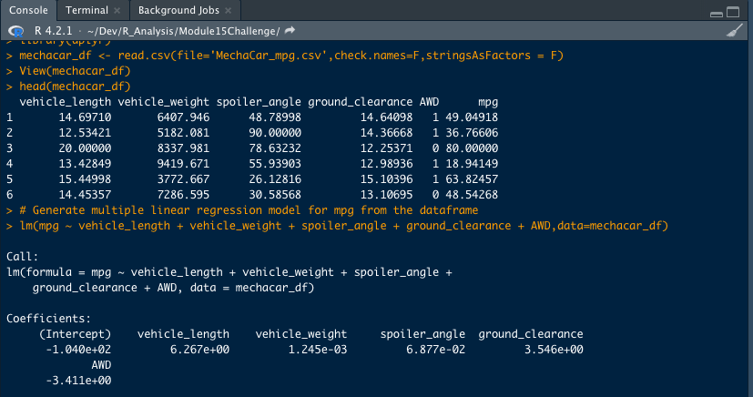

# MechaCar_Statistical_Analysis

The purpose of this project is to analysis to identify which variables in our *MechaCar_mpg*
dataset predict the *mpg* of MechaCar prototypes.

## Linear Regression to Predict MPG
We want to generate a multiple linear regression model using the lm() function with these
variables

```lm(mpg ~ vehicle_length + vehicle_weight + spoiler_angle + ground_clearance + AWD,data=mechacar_df)```

where *mechacar_df* is our dataframe that is generated from our *MechaCar_mpg* dataset.
The linear regression model produced is:



We then run summary() function on our regression model to obtain our p-values and r-squared values
with: 

```summary(lm(mpg ~ vehicle_length + vehicle_weight + spoiler_angle + ground_clearance + AWD,data=mechacar_df))```

Our produced summary is:


### Which variables/coefficients provided a non-random amount of variance to the mpg values in the dataset?
From our produced summary we can see that the variables' coefficients that provide non-random amounts of variance
to the *mpg* values are:
- vehicle-length
- ground-clearance

based on a 2.60 x 10^-12 p-value for vehicle-length
and a 5.21 x 10^-8 p-value for ground-clearance

```
> summary(lm(mpg ~ vehicle_length + vehicle_weight + spoiler_angle + ground_clearance + AWD,data=mechacar_df))

Call:
lm(formula = mpg ~ vehicle_length + vehicle_weight + spoiler_angle + 
    ground_clearance + AWD, data = mechacar_df)

Residuals:
     Min       1Q   Median       3Q      Max 
-19.4701  -4.4994  -0.0692   5.4433  18.5849 

Coefficients:
                   Estimate Std. Error t value Pr(>|t|)    
(Intercept)      -1.040e+02  1.585e+01  -6.559 5.08e-08 ***
vehicle_length    6.267e+00  6.553e-01   9.563 2.60e-12 ***
vehicle_weight    1.245e-03  6.890e-04   1.807   0.0776 .  
spoiler_angle     6.877e-02  6.653e-02   1.034   0.3069    
ground_clearance  3.546e+00  5.412e-01   6.551 5.21e-08 ***
AWD              -3.411e+00  2.535e+00  -1.346   0.1852    
---
Signif. codes:  0 ‘***’ 0.001 ‘**’ 0.01 ‘*’ 0.05 ‘.’ 0.1 ‘ ’ 1

Residual standard error: 8.774 on 44 degrees of freedom
Multiple R-squared:  0.7149,	Adjusted R-squared:  0.6825 
F-statistic: 22.07 on 5 and 44 DF,  p-value: 5.35e-11
```


### Is the slope of the linear model considered to be zero? Why or why not?
Because we vehicle-length and ground-clearance would make up two significant linear relationships, we
can claim that the slope of our linear model is NOT zero. In addition, we have a *p-value* much
less than *0.05* with *5.35 x 10^-11* value for p-value. Which means that we can reject our
null hypothesis of: `H0 : The slope of the linear model is zero, or m = 0`

### Does this linear model predict mpg of MechaCar prototypes effectively? Why or why not?
Based on the results of our summary, we have an R-squared value of *0.7149* which suggests
that, in fact, this model should predict *mpg* effectively


## Summary Statistics on Suspension Coils

Our total summary of the suspension coils will be calculated with 
`total_summary <- suspension_coil_df %>% summarize(Mean=mean(PSI),Median=median(PSI),Variance=var(PSI),SD=sd(PSI), .groups = 'keep')`
and produces this dataframe:


Our individual lot summary will be calculated with:
`lot_summary <- suspension_coil_df %>% group_by(Manufacturing_Lot) %>% summarize(Mean=mean(PSI),Median=median(PSI),Variance=var(PSI),SD=sd(PSI), .groups = 'keep')`
and produces this dataframe:


In summary, based on our Lot summary dataframe, all but one manufacturing lot meets the
design specifications for the Mechacar suspension coils. The Lot Summary shows that
manufacturing lot 3 does not fall within the 100 PSI variance. Lots 1 and 2 fall within the
100 PSI variance with 0.98 and 7.5 PSI respectively. But Lot 3's variance is at 170.3 PSI

## T-Tests on Suspension Coils
We performed T-Tests on our Sample data to determine if all manufacturing lots and 
each lot individually are statistically different from the population mean of 1,500 pounds per square inch

Our overall T-Test of all manufacturing lots yeilds these results:


with a p-value of *0.4478* we can not reject the null hypothesis and should consider that
there is no significant difference between our all manufacturing lot Sample PSI means and the population
PSI mean. 

Testing the manufacturing lots individually we get:


with all three p-values above *0.05* we still can not reject the null hypothesis and should consider
that there is no significant difference between our individual manufacturing lot samples and the 
population.

In Summary, we can consider our sample set to be an accurate representation of our population with
regard to PSI.


